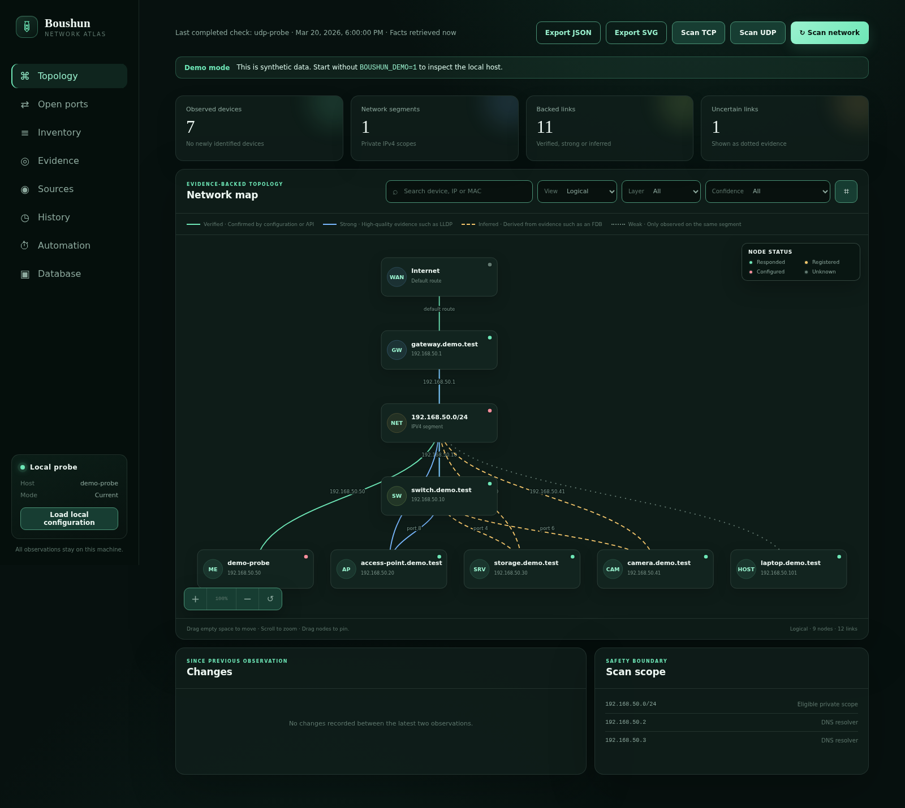
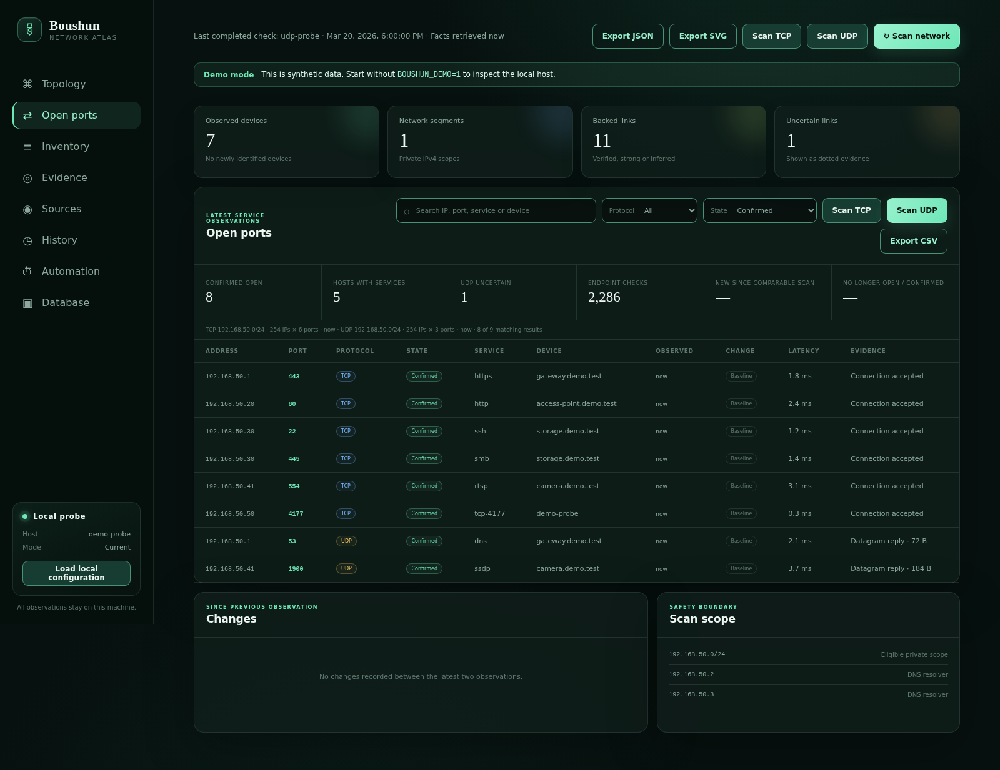

# Boushun

Boushun (忘春) is a local-first, evidence-backed LAN inventory and topology map. The name comes from the title of a poem by Murō Saisei and suits a tool that brings overlooked devices back into view.

Boushun keeps raw observations on the probe, distinguishes facts from inference, and lets an operator correct device identity without destroying collected data.

## What v0.1.0 provides

- Local-first inventory composed from Linux, DHCP, Kubernetes, controller exports, multicast, SNMPv3, and OUI observations.
- Bounded ICMP discovery plus independent TCP and UDP service discovery across every usable address in an explicitly allowed CIDR.
- Physical, Logical, and Services topology views that distinguish observed facts from inferred placement.
- Searchable inventory, confirmed open-port views, per-address rescans, current-state composition, history, comparison, schedules, and notifications.
- Manual identity correction and merge/split controls that preserve the original evidence.
- Local database export, validated preview/import, backup, and reset workflows with atomic JSON storage.

See the [feature reference](docs/features.md) for the complete capability list.

## Live demo

[Open the static read-only demo](https://emstoo.github.io/boushun/).

The GitHub Pages demo is generated entirely from bundled synthetic observations. It does not connect to, inspect, or scan a real LAN, and actions that would change Boushun state are disabled. Topology navigation, search, filters, node inspection, pan/zoom, and client-side exports remain available for exploring the interface.

The public demo is a generated static artifact, not a remotely exposed Boushun server. Live LAN collection still requires running Boushun locally as described below.

## Screenshots





Both screenshots are generated from a fixed-clock synthetic network by `npm run screenshots`. They contain no observations from a real LAN and can be reproduced as part of the release checks.

## Static read-only demo

Generate the same public-demo artifact locally with:

```console
npm run demo:build
```

The command writes a static site to `dist/demo/`. During the build, Boushun starts only on loopback with a temporary store, projects the bundled synthetic collector through the normal server APIs, captures the resulting state/history/database/automation responses, and then shuts the server down. The generated site serves those captured responses in the browser and rejects mutating API calls.

On pushes to `main`, the Pages workflow builds `dist/demo/` and deploys that artifact to `https://emstoo.github.io/boushun/`. Generated assets use relative paths so the site works below the GitHub Pages project subpath.

`npm run demo` is different: it starts the normal Boushun Node.js server locally with synthetic collection enabled. It remains subject to the same loopback-only server boundary as a normal local installation.

## Quick start with Docker

Live LAN collection requires Docker Engine with the Compose plugin on Linux. Boushun uses host networking so the container can see the host interfaces, neighbor cache, and local multicast traffic. The UI listens only on host loopback.

```console
cp .env.example .env
# Edit .env and set BOUSHUN_ALLOWED_CIDRS to the private LAN range to scan.
docker compose up --detach --build
docker compose ps
```

Open <http://127.0.0.1:4177>. Follow logs with `docker compose logs --follow`. Stop the application with `docker compose down`; the `boushun-data` volume is retained. Export the database from the Database screen before intentionally deleting that volume with `docker compose down --volumes`.

The image runs as a non-root user with a read-only root filesystem. Compose grants only `NET_RAW` for ICMP probes and mounts `/data` as the writable database volume. Docker Desktop is not a supported live-probe environment because Boushun requires direct visibility of the Linux host network stack.

### Local Node.js development

Requirements are Linux, a supported Node.js 22, 24, or 26 release, `ip`, and `ping`. Kubernetes integration uses the client library with the standard kubeconfig search path outside a cluster or the mounted ServiceAccount inside a cluster; it does not shell out to `kubectl`. Startup collection is passive.

```console
cd boushun
npm ci
BOUSHUN_ALLOWED_CIDRS=192.168.50.0/24 npm start
```

Use `npm run demo` for a local synthetic server without inspecting the LAN. Use `npm run demo:build` when you need the static read-only artifact used by GitHub Pages.

## Documentation

- [Feature reference](docs/features.md)
- [Configuration and data sources](docs/configuration.md)
- [Scanning, safety, storage, and recovery](docs/operations.md)
- [HTTP API reference](docs/api.md)
- [Test design](docs/test-design.md)
- [Security policy](SECURITY.md)

## Security boundary

Boushun accepts only loopback listen addresses and supports one operator on the probe host. It validates the request host and rejects cross-origin browser requests, but it has no authentication, TLS termination, session management, RBAC, or trusted-proxy handling. Local users and processes that can reach the listener are trusted; remote and multi-user publication of the Boushun server is not supported.

The GitHub Pages demo does not relax this boundary. It publishes only generated static assets and synthetic projected API fixtures; no collector, local database, scanning endpoint, credential source, or Boushun server is exposed by the demo deployment.

Active discovery is disabled unless its complete target range is covered by `BOUSHUN_ALLOWED_CIDRS`. Configure the smallest practical private range and use only networks you are authorized to scan.

## Tests and reproducible screenshots

```console
npm run check
npm run demo:build
npx playwright install chromium
npm run test:e2e
npm run test:container
npm run screenshots
npm run verify:screenshots
```

`npm run check` covers syntax, unit, component, store, loopback API tests, and the fixed-clock static-demo build contract. Browser acceptance and screenshot generation use only the bundled synthetic fixture. Screenshot verification checks the generated PNG structure, expected width, minimum height, and absence of textual metadata.

`npm run demo:build` produces the same static artifact shape uploaded by the GitHub Pages workflow. Its automated test verifies synthetic projected state, representative TCP/UDP services, history detail, read-only fixture behavior, and project-subpath-safe asset paths.

`npm run test:container` requires Docker Engine and Compose on Linux. It builds the production image and verifies passive collection, real ICMP and TCP traffic, runtime restrictions, and data persistence across container recreation in a disconnected synthetic network namespace. It ignores local Compose overrides and `.env`, requires the `boushun-ci` project and its data volume to be unused, and removes its test containers and volume afterward. Production host networking is checked in the rendered configuration; real LAN behavior, UDP, multicast, SNMP, Kubernetes, and controller acceptance still require a separately authorized environment.

On `SIGINT` (Ctrl+C) or `SIGTERM`, container acceptance stops the active CLI process group, waits for it to close, then cleans up its test resources and exits unsuccessfully. Repeated signals do not interrupt cleanup. An existing project rejected during preflight is never removed. Cleanup failures are reported explicitly; `SIGKILL`, loss of the Docker daemon, or host shutdown can still leave resources behind and require inspection before rerunning.

Coverage, environments, priorities, and release gates are defined in the [test design](docs/test-design.md).

## Known boundaries

- Linux is the only probe OS and discovery is oriented around one local broadcast domain.
- ARP/neighbor, mDNS, SSDP, and forwarding-table observations are evidence, not proof of physical cabling.
- UDP silence is reported as uncertain (`open-or-filtered`), never as a confirmed open service.
- SNMP VLAN membership and vendor-native UniFi/Omada data are integrated through controller exports.
- IPv6 NDP collection, distributed multi-site probes, authenticated remote access, and multi-user storage are not implemented.
- The JSON store is intended for one probe process.
